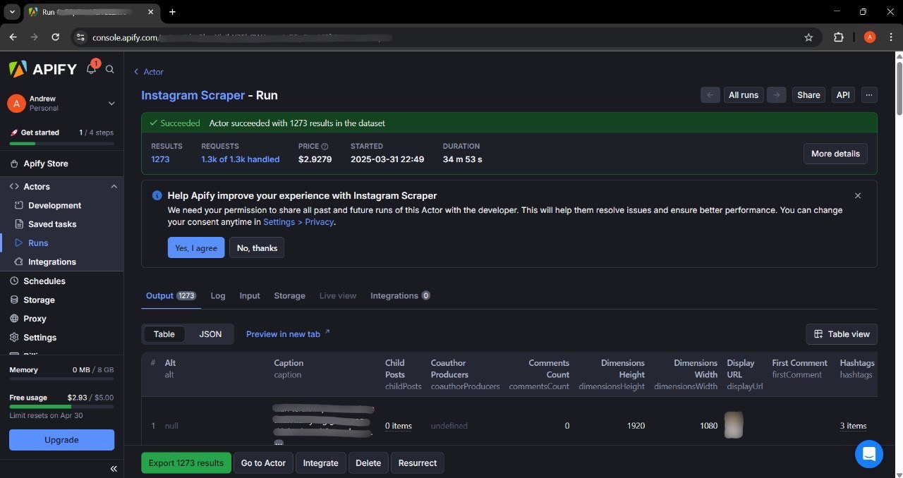
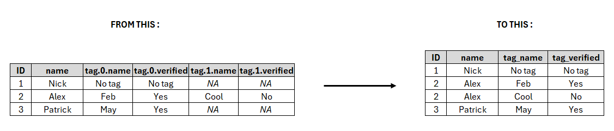

```{r setup, include=FALSE}
knitr::opts_chunk$set(
  message = FALSE,
  warning = FALSE,
  fig.align = "center",
  out.width = "600px", 
  fig.retina = 1,
  comment = ">"
)
```

```{r include=FALSE}
colorize <- function(x, color) {
  if (knitr::is_latex_output()) {
    sprintf("\\textcolor{%s}{%s}", color, x)
  } else if (knitr::is_html_output()) {
    sprintf("<span style='color: %s;'>%s</span>", color,
      x)
  } else x
}
```

<hr>

***Disclaimer**: The data presented is derived from public Instagram content. All account names and usernames displayed have been replaced with pseudonyms to protect the privacy of the original account holders. This anonymization prevents identity tracing, misuse of data, or harm to third parties. There is no association between these aliases and real Instagram accounts.*

<hr>

# `r colorize("**Introduction**", "#8093f1")`

Instagram is a go-to social media platform for brands to connect with their audience, share updates, and promote their products. In this project, I will try to analyze the Instagram account of a healthy snack brand named AO Snack (`r colorize("@aosnack.brand", "#8093f1")`) (*pseudonym*) by extracting the data using [`r colorize("Apify", "#8093f1")`](https://apify.com/?fpr=ifj7v). Through this project, I aim to gain a deeper understanding of the end-to-end workflow of a data analyst. The process will involve data extraction, data cleaning and preparation for analysis, and answering some business questions to deriving insights.

`r colorize("**Business Questions**", "#8093f1")`

1. [`r colorize("Which posts have highest engagement?", "black")`](#Q1)
2. [`r colorize("What type of post, video or photo, drives higher engagement?", "black")`](#Q2)

<br>

# `r colorize("**Libraries**", "#8093f1")`

```{r, console=FALSE}
library(dplyr)
library(tidyr)
library(lubridate)
library(ggplot2)
library(moments)
library(effsize)
```

<br>

# `r colorize("**Data Extraction**", "#8093f1")`

The dataset of AO Snack (`r colorize("@aosnack.brand", "#8093f1")`) Instagram account was collected using the [`r colorize("Apify Instagram Scraper", "#8093f1")`](https://apify.com/apify/instagram-scraper). The dataset consists of post metrics retrieved on March 31, 2025 at 10:49 PM (GMT+7) . It includes all posts from the account's inception up to the time of data scraping. The collected metrics include likes, comments, tagged users, and various other engagement indicators. After the scraping process, the dataset was filtered to include only the required metrics and then exported to a CSV file.

<br>

```{r echo = FALSE, out.width="90%", fig.align = "center", fig.cap = "Figure 1. Apify Instagram Scraper Web View"}

```

<br>

# `r colorize("**Data Cleaning and Preparation**", "#8093f1")`

## `r colorize("**Import Dataset**", "#79b8f4")`

```{r}
df <- read.csv("data_input/instagram_post_dataset.csv")
head(df)
```

<br>

In the imported dataset, there are empty data that can be considered as *missing values* (NA). Therefore, the data is re-imported with additional arguments to make empty data into NA.

<br>

```{r}
df <- read.csv("data_input/instagram_post_dataset.csv", na.strings=c("","NA"))
head(df)
```

<br>

Here is a peek of the dataset :

<br>

```{r}
glimpse(df)
```

<br>

## `r colorize("**Data Description**", "#79b8f4")`

Some of the attributes scraped using Apify contain sub-attributes. For example, the coauthorProducers attribute includes sub-attributes such as id, username, and other related attributes. Each attributes and sub-attributes is represented by a single column in the dataset. During the reshaping stage, all attributes and sub-attributes with indexing will be merged into a single set of columns (one for each attribute) without numerical indexing. Here is an explanation of the columns in the dataset :

<hr>

- **`coauthorProducers`** : represents the accounts that are *co-authors* of a post. Each account has several attributes, including:
  - **`is_verified`** : verification status of the account (true/false).  
  - **`username`** : username of the account.  
- **`commentsCount`** : the number of comments on the post.  
- **`likesCount`** : the number of likes the post received.  
- **`mentions`** : accounts that are mentioned in the post.  
- **`ownerFullName`** : full name of the account owner who posted the content.
- **`ownerUsername`** : username of the account owner.
- **`productType`** : the type of content uploaded (clips, igtv, and photo).
- **`taggedUsers`** : accounts that are tagged in the post. Each account has several attributes, including:  
  - **`full_name`** : full name of the tagged user.
  - **`is_verified`** : verification status of the tagged account (true/false). 
  - **`username`** : username of the tagged account.
- **`timestamp`** : the time when the post was created.  
- **`type`** : the type of post (video, image, and sidecar).  
- **`videoDuration`** : the duration of the video (if the post is a video).
- **`videoPlayCount`** : the number of times the video has been played.
- **`videoViewCount`** : the number of times the entire video has been watched.

<hr>

## `r colorize("**Add Column ID of Posts**", "#79b8f4")`

Before going further, column **`id`** is added for identification (ID) of each post that represented by each row. Column **`id`** will help in identifying each post for further data analysis. First, data type of **`timestamp`** will be changed to `datetime` then the dataset will be sorted by **`timestamp`**. This process will assign sequential IDs to the posts, where the first post will be given ID 1, the second post will have ID 2, and so on.

<br>

```{r}
df_clean <- df %>% 
  # Change column `timestamp` data type to `datetime`
  mutate(timestamp = ymd_hms(timestamp, tz = "Asia/Jakarta")) %>%
  # Sort dataset by column `timestamp`
  arrange(timestamp)
```

```{r}
# Add column `id`
df_clean <- df_clean %>% mutate(id = row_number())
```

```{r}
glimpse(df_clean)
```

<br>

## `r colorize("**Missing Values**", "#79b8f4")`

```{r}
# Check for missing values
colSums(is.na(df_clean))
```

<br>

Based on the result, there are missing values in column **`mentions..`**, **`taggedUsers..`**, **`productType`**, **`coauthorProducers..`**, **`videoViewCount`**, **`videoPlayCount`**, and **`videoDuration`**. To handle these missing values, I will reshape the dataframe, apply an imputation method, and perform feature engineering.

<br>

### `r colorize("**Reshaping Dataframe**", "#79b8f4")`

Before reshaping the data, I will impute the missing values on column **`coauthorProducers.`**, **`mentions.`**, dan **`taggedUsers.`** with index **`.0`**. It will give an information for posts that doesn't have co-author producer, mention, or tagged user.

<br>

```{r}
df_clean <- df_clean %>% 
  mutate_at(vars(starts_with("coauthorProducers.0")), ~replace(., is.na(.), "No co-author")) %>% 
  mutate_at(vars(starts_with("mentions.0")), ~replace(., is.na(.), "No mention")) %>% 
  mutate_at(vars(starts_with("taggedUsers.0")), ~replace(., is.na(.), "No tag"))
```

<br>

For column **`mentions..`** that doesn't have sub-attribute, reshaping process will consists of pivot longer (wide to long) and column modification. Pivot longer will produce two new columns i.e. `name` and `value`. Column `name` will be remove because it is unneeded. Column `value` will be kept and it will be rename to **`mention_username`**.

At the end of the process, there will be rows with missing value in column **`mention_username`**. These rows are unnecessary because mention attribute information for each post already represented by mentioned username or "No mention". Therefore, these rows with missing value will be remove.

<br>

```{r}
df_clean <- df_clean %>% 
  # Reshape attribute `mentions` from wide (columns) to long (rows)
  pivot_longer(cols = starts_with("mention"),
               values_to = "mention_username") %>%
  # Removed column 'name' because it is unnecessary
  select(-name) %>% 
  # Remove rows that contains missing value in column `mention_username`
  drop_na(mention_username)
```

<br>

For column **`coauthorProducers..`** and **`taggedUsers..`** that have sub-attributes, there will be some differences reshaping process. For this case, I made a custom function named **`longer(..)`**. This function will reshape the columns of attributes and its sub-attributes with many index in wider format into columns of attributes and its sub-attributes in longer format without index. The full explanation about this function (**`longer(..)`**) is in [`r colorize("**Function Validation**", "#8093f1")`](#FunctionValidation) at the end of this project.

<br>

```{r}
# Custom Function -> `longer(..)`
longer <- function(x, y){
  # Reshape columns from wide to long
  pivot_longer(data = x,
               # Select columns with name that starts with argument `y`
               cols = starts_with(y),
               # Produce three columns of attribute, index, and sub-attribute
               names_to = c("attribute", "index", "sub-attribute"),
               # Column name separator `.` that separate attribute, index, and sub-attribute
               names_sep = "\\.") %>% 
    # Remove column attribute because it's not needed
    select(-attribute) %>% 
    # Reshape columns of sub-attributes from long to wide to make columns of sub-attributes without indexing
    pivot_wider(names_from = "sub-attribute", values_from = "value", names_prefix = paste0(y,"_")) %>% 
    # Remove column attribute because it's not longer needed
    select(-index) %>% 
    # Remove rows that contains missing value in columns with name that starts with argument `y`
    drop_na(starts_with(y))
}

# For more detail explanation, go to 'Function Validation' at the end of this project.
```

#NONEED
```{r}
df_clean <- df_clean %>% 
  select(-contains(c('.id','profile')))
```


```{r}
# Apply function `longer(..)` to `coauthorProducer` and `taggedUser` to reshape them.
df_clean <- df_clean %>%
  longer("coauthorProducers") %>% 
  longer("taggedUsers")
```

<br>

After the reshaping process, this is a peek of the dataset :

<br>

```{r}
glimpse(df_clean)
```

<br>

```{r}
# Check for missing values
colSums(is.na(df_clean))
```

<br>

Columns of **`coauthorProducers`** and **`taggedUser`** has become longer without indexing and doesn't have any missing values. In the next section, I will apply imputation method to handle the rest missing values.

<br>

### `r colorize("**Imputation Value**", "#79b8f4")` 

First, I will handle missing values on column **`productType`**. This columns contains the product type of Instagram Post that is photo, clips, or igtv. Now, 

<br>

```{r}
unique(df_clean$productType)
```

```{r}
df_igtv <- df_clean %>% 
  filter(productType == "igtv")

df_clips <- df_clean %>% 
  filter(productType == "clips")

unique(df_igtv$type)
unique(df_clips$type)
```

```{r}
unique(df_clean$type)
```

```{r}
df_clean <- df_clean %>% 
  mutate(productType = ifelse(is.na(productType), "photo", productType))
```

<br>

to verify there is video type in photo productType, I check the unique value in data that has photo as product type.

<br>

```{r}
# Filter rows that contains "photo" as 
df_photo <- df_clean %>% 
  filter(productType == "photo")

# Check for unique value
unique(df_photo$type)
```

```{r}
colSums(is.na(df_clean))
```


<br>

Next, I will check for the rows that contains missing values in videoViewCount

<br>

```{r}
df_clean %>% 
  filter(is.na(videoViewCount) == TRUE) %>% 
  head(10)
```

<br>

Based on the result, the data that contains missing values in column **`videoViewCount`**, **`videoPlayCount`**, and **`videoDuration`** have the same product type which is photo. Therefore, value 0 will be imputed to these columns with product type "photo" because there is no duration in photo and to keep the columns in numerical data type.

<br>

```{r}
# Imputation value 0 to columnn `videoDuration`, `videoPlayCount`, and `videoViewCount`
df_clean <- df_clean %>% 
  mutate(videoDuration = ifelse(productType=="photo",0,videoDuration)) %>%
  mutate(videoPlayCount = ifelse(productType=="photo",0,videoPlayCount)) %>% 
  mutate(videoViewCount = ifelse(productType=="photo",0,videoViewCount))

# Re-check for missing values after imputation
colSums(is.na(df_clean))
```

<br>

Missing values from column **`videoViewCount`** and column **`videoDuration`** have been handled. There is still some missing values in column **`videoPlayCount`**. Therefore, further check must be performed.

<br>

```{r}
# Check for missing values in column `videoPlayCount`
df_clean %>% 
  filter(is.na(videoPlayCount) == TRUE)
```

<br>

These rows with missing value has same product type which is "igtv" and same type which is "Video". Before going further, product type "igtv" will be changed to "clips" as that type of feature is not longer available.

<br>

```{r}
df_clean$productType[df_clean$productType == "igtv"] <-  "clips"
unique(df_clean$productType)
```

<br>

To handle this missing values on column **`videoPlayCount`**, I will perform feature engineering to make a metrics called `Completion Rate` of a video and perform a calculation to get value for imputation. 

<br>

### `r colorize("**Feature Engineering: Completion Rate**", "#79b8f4")` 

The completion rate of a video is a key metric that measures how often viewers watch a video in its entirety. It is calculated by dividing the total number of complete views by the total number of video plays. In this context, the total number of complete views is represented by the column **`videoViewCount`**, while the total number of video plays is represented by the column **`videoPlayCount`**. The formula can be expressed as:

<br>

$$Completion\:Rate = \frac{Total\:Number\:Complete\:Views}{Total\:Video\:Plays} \times 100$$

<br>

This percentage indicates the engagement level of the audience, helping content creators and marketers assess how compelling their videos are. A higher completion rate suggests that viewers are more likely to watch the video to the end, while a lower rate may indicate a need for improvements in content or presentation.

<br>

For this case, I choose to using value of **`videoPlayCount`** from completion rate calculation for imputation missing values in **`videoPlayCount`**. This value will fit better to estimating missing values in **`videoPlayCount`** than the mean of **`videoPlayCount`** itself. This is because the completion rate accounts for viewer engagement patterns, making it a more stable and representative measure. If **`videoPlayCount`** is missing for a video, using the average completion rate (derived from other videos) allows for a more accurate estimation by considering typical viewer behavior rather than just raw play counts. Using the average play count itself can be inaccurate because it may include values lower than the view count in cases of missing data, which is nonsensical.

<br>

For example, if the average completion rate is 50%, and a video has **`videoViewCount = 200`**, the estimated **`videoPlayCount`** would be **`200 / 0.5 = 400`**. This approach reduces bias from outliers (such as viral videos with unusually high play counts) and provides a more reliable imputation for missing data. The formula for total video plays (**`videoPlayCount`**) :

<br>

$$Total\:Video\:Plays =\frac{Total\:Number\:Complete\:Views}{Completion\:Rate} \times 100$$

<br>

Starts with create a new column named **`completionRate`** with value from formula **`(videoViewCount/videoPlayCount)*100`** if the type is video and value zero if the type is not video. Then, the mean **`completionRate`** will be computed across all records where the type is video except the data with missing values.

<br>

```{r}
# Create a new column `completionRate`
df_clean <- df_clean %>%
  mutate(completionRate = ifelse(type == "Video",((videoViewCount/videoPlayCount)*100),0))
```

```{r}
# Check completionRate distribution
df_clean %>% 
  distinct(id, .keep_all = TRUE) %>% 
  filter(type == "Video") %>% 
  select(completionRate) %>%
  boxplot(horizontal = T)
```

```{r}
# Check for the outlier which completion rate more then 100%
df_clean %>% 
  filter(completionRate > 100)
```

<br>

Out of 1,273 data points, two have a completion rate exceeding 100%. A completion rate above 100% is illogical. Therefore, these data points will be removed as they may distort insights.

<br>

```{r}
# Remove data with completion rate > 100%
df_clean <- df_clean %>% 
  filter(completionRate < 100)
```


```{r}
# Check again completionRate data distribution after removing outlier
df_clean %>% 
  distinct(id, .keep_all = TRUE) %>% 
  filter(type == "Video") %>% 
  select(completionRate) %>%
  boxplot(horizontal = T)
```
<br>

The **`completionRate`** data is fairly normally distributed, and its mean value will be calculated.

<br>

```{r}
# Calculate mean of `completionRate`
mean_completionRate <- df_clean %>% 
  distinct(id, .keep_all = TRUE) %>% 
  filter(type == "Video") %>% 
  # Remove data that contains missing values
  na.omit() %>% 
  # Take just the column `completionRate` for calculation
  pull(completionRate) %>% 
  # Calculate the mean
  mean()

mean_completionRate
```

<br>

The calculated mean completion rate across video-type posts is 39.82432%. This value will serve as the imputation reference for null entries in the **`completionRate`** column, enabling subsequent estimation of missing **`videoPlayCount`** values.

<br>

```{r}
df_clean <- df_clean %>% 
  # Imputation mean of completion rate for missing value in column `completionRate`
  mutate(completionRate = ifelse(is.na(completionRate)==TRUE, mean_completionRate, completionRate)) %>% 
  # Imputation estimated value of video play count for missing value in column `videoPlayCount`
  mutate(videoPlayCount = ifelse(is.na(videoPlayCount)==TRUE,round(((videoViewCount/completionRate)*100)), videoPlayCount))

# Check for missing values
colSums(is.na(df_clean))
```

<br>

The dataset is now complete, with all previously missing values properly handled.

<br>

## `r colorize("**Duplicate Rows**", "#79b8f4")`

```{r}
# Check for duplicate rows
dim(df_clean[duplicated(df_clean),])[1]
```

<br>

The dataset contains **no duplicates**.

<br>

## `r colorize("**Data Type Adjusment**", "#79b8f4")`

```{r}
# Peek the dataset structure
glimpse(df_clean)
```

<br>

Columns requiring data type conversion :

- **`productType`**, **`type`**, **`coauthorProducer_is_verified`**, and **`taggedUser_is_verified`** to factor.
- **`videoViewCount`** and **`videoPlayCount`** to integer.

<br>

```{r, message= FALSE}
df_clean <- df_clean %>% 
  # Change columns data type to factor
  mutate_at(vars(productType, type, coauthorProducers_is_verified, taggedUsers_is_verified),as.factor) %>% 
  # Change columns data type to integer
  mutate_at(vars(videoViewCount, videoPlayCount), as.integer)

# Peek the dataset structure
glimpse(df_clean)
```

<br>

All columns now have the appropriate data types.

<br>

## `r colorize("**Rearrange Columns**", "#79b8f4")` 

Column positions are rearranged to improve data readability, analysis efficiency, and logical flow of information. By organizing columns in a meaningful order (e.g., grouping related variables, placing key identifiers first, or following a chronological sequence), the data becomes more intuitive to interpret and reduces cognitive load for users. Certain columns also will be renamed to enforce naming consistency.

<br>

```{r}
df_clean <- df_clean %>% 
  # Re-arrange columns position
  select(id,timestamp, ownerFullName, ownerUsername, productType, type, coauthorProducers_username, coauthorProducers_is_verified, taggedUsers_full_name, taggedUsers_username, taggedUsers_is_verified, mention_username, likesCount, commentsCount, videoDuration, videoPlayCount, videoViewCount, completionRate) %>% 
  # Rename columns
  rename(coauthorProducerUsername = coauthorProducers_username,
         coauthorProduceIsVerified = coauthorProducers_is_verified,
         taggedUseFullName = taggedUsers_full_name,
         taggedUserUsername = taggedUsers_username,
         taggedUserIsVerified = taggedUsers_is_verified,
         mentionUsername = mention_username)
head(df_clean)
```

<br>

**Data cleaning and preparation is complete** - resulting in an analysis-ready dataset.

<br>

# `r colorize("**Data Analysis**", "#8093f1")`

The primary goal of this data analysis is to identify post characteristics that drive high engagement. By leveraging the insights obtained, we aim to create content that maximizes and improves engagement. The quantitative analysis is based solely on available data, focusing exclusively on likes and comments per post as the engagement metrics. First, a quick statistical summary of likes and comments of all posts will be examined.

<br>

```{r}
df_clean %>% 
  distinct(id, .keep_all = TRUE) %>% 
  select(likesCount,commentsCount) %>% 
  summary()
```

<br>

Out of all posts, the range of likes and comments varies significantly. The maximum values are extremely high compared to others, suggesting some posts may have gone viral. Additionally, illogical values have been found like -1 in the **`likesCount`** data. After manual verification (by viewing the actual posts), it is confirmed that -1 represents posts where likes were hidden by the user.

<hr>

***Disclaimer**: All qualitative evaluations of Instagram posts in this study were genuinely conducted because the original (non-anonymized) data from Apify contained post URLs. These URLs have since been removed to ensure complete data anonymization.*

<hr>

```{r}
df_clean %>% 
  distinct(id, .keep_all = TRUE) %>% 
  filter(likesCount<0)
```

```{r}
# Check number of posts
df_clean %>% 
  distinct(id, .keep_all = TRUE) %>% 
  nrow()
```

<br>

Only 7 out of 1,267 posts (0.55%) had hidden like counts, removing them won't significantly affect the dataset while keeping the analysis clean and maintain data consistency in our analysis. Then, engagement column will be created by summing likes and comments.

<br>

```{r}
df_clean <- df_clean %>%
  # Remove data with likesCount lower than zero
  filter(likesCount>=0) %>% 
  # Create column engagementCount
  mutate(engagementCount = likesCount + commentsCount)
```

<br>

The dataset contains duplicate post IDs caused by variations in other features (taggedUser, mentions, etc.). To ensure analysis accuracy and simplify further processing, we removed duplicate post IDs, storing the cleaned data in the `df_id` variable while retaining only one entry per unique post. This prevents skewed results from duplicate content measurements.

<br>

```{r}
df_id <- df_clean %>% 
  distinct(id, .keep_all = TRUE)
```

<br>

## `r colorize("**1. Posts with Highest Engagements**", "#79b8f4")` {#Q1}

```{r}
# Examine top 10 post with highest engagements
df_id %>% 
  arrange(desc(engagementCount)) %>% 
  top_n(10)
```

<br>

Qualitative analysis of the top 10 posts' content reveals common characteristics: these posts consistently feature brand-relevant content, either showcasing product strengths or sharing authentic consumer testimonials. Meanwhile, the attached data provides these key insights:

1. 9 out of 10 top-performing posts are videos, with only 1 being a static photo.  
2. All 10 high-engagement posts involved collaborations – either with influencers or complementary brands aligned with the brand image (e.g., sporty influencers, hampers brand, or sports events where our product adds value).  
3. Every collaborating influencer in these top posts – whether tagged or listed as co-author – is verified, confirming their authenticity and credibility.  

These insights prompt deeper exploration through follow-up business questions:

1. Do posts categorized as clips drive higher engagement?  
2. Do posts with tagged users or co-authors significantly boost engagement?  
3. Which influencers deliver the largest engagement impact?  

<br>

## `r colorize("**2. Post Type with Higher Engagement**", "#79b8f4")` {#Q2}

The analysis will begin with a distribution count of posts by type before proceeding to engagement comparisons.

<br>

```{r}
df_id %>% 
  count(productType)
```

<br>

The data distribution between clips and photo post types is sufficiently balanced, allowing for direct comparison of their engagement metrics.

<br>

```{r, echo=FALSE}
plot(engagementCount ~ productType, data = df_id, horizontal = T)
```

<br>

The data contains many outliers and is heavily skewed. Therefore, the median will be used to compare the engagement between the two post types, as it provides a more realistic measure of central tendency than the mean.

<br>

```{r}
# Engagement stats summary of clips type
summary(df_id$engagementCount[df_id$productType == "clips"])
```

```{r}
# Engagement stats summary of photo type
summary(df_id$engagementCount[df_id$productType == "photo"])
```

<br>

Based on the boxplot and statistical summary above, several insights were obtained, as follows:

1. There are several viral posts (as indicated by the outliers) with significantly higher engagement in clips compared to photos and the maximum engagement for clips (222,262) far exceeds that of photos (66,628), indicating that clips have a higher potential for viral reach.
2. Clips tend to generate higher engagement than photos, with a median of 361 compared to 129. Half of all clips achieve engagement above 361, while half of photos fall below 129.
3. Based on Q1 to Q3, clips (152-1022) show a broader spread of engagement compared to photos (67-247), meaning the middle 50% of clips have much higher engagement. This suggests clips are more likely to drive higher engagement, though variability is also greater.

While clips generally perform better, the Q1-Q3 ranges overlap (photos go up to 247, clips start at 152). It means some photos still compete with lower-performing clips. Therefore, a statistical test (Mann-Whitney U) will be conduct to see the difference in engagement between the two types is significant or due to random variation.

<br>

```{r}
# Check level of productType
levels(df_id$productType)
```

<br>

Hypothesis of Mann-Whitney U test for this case:

$H_{0}$: There is no difference in engagement distribution between clip and photo posts.  
$H_{1}$: The engagement distribution of clips is stochastically greater than photos.

<br>

```{r}
# Mann-Whitney U Test
wilcox.test(engagementCount ~ productType,
            data = df_id,
            alternative = "greater")
```

<br>

With the result (p < 2.2e-16), the null hypothesis ($H_{0}$) is rejected. Statistically, the engagement distribution of clips is stochastically greater than photos. Since the difference in engagement between the two post types is significant, the effect size will be evaluated using Cliff's Delta test.

<br>

```{r}
cliff.delta(engagementCount ~ productType, data = df_id)
```

<br>

The Mann-Whitney U test (p < 2.2e-16) reveals that clip-type posts achieve significantly higher engagement than photo-type posts, with a medium-to-large effect size (Cliff’s Delta ≈ 0.46). This finding indicates that **clips are not only statistically superior but also exert a practically meaningful impact on engagement**.

<br>

# `r colorize("**Preliminary Conclusion**", "#8093f1")`

Based on the work completed up to this point, here are the highlights from the current findings:

- Among the top-performing posts, 9 out of 10 are video content, with only 1 being a static photo. This finding highlighting a strong preference and effectiveness of video format. A deeper analysis of engagement metrics also reveals that videos are statistically superior and deliver higher impact on engagement. ***Therefore, choosing video content is recommended to achieve better engagement***.

The analysis of the data is still in progress, with the following questions currently being explored to obtain a more comprehensive understanding:

1. How long should the video content be to achieve higher engagement?
2. Do posts with tagged users or co-authors significantly boost engagement?
3. Which influencers deliver the largest engagement impact?

# `r colorize("**Suggestions for Improvement**", "#8093f1")` 

Here are several suggestions for deeper insights that couldn’t be explored in this project due to limited data, but could provide meaningful value to the business in the future:

1. Use historical data on likes, comments, and followers at that time in order to calculate the engagement rate, which is useful for measuring the relevance or quality of the content.
2. Use the data of category video. It can be done by requesting it to marketing or content maker team. With the data of video category, we can dig more specifically of video characteristics that drives higher engagement.
3. Consider tracking sales data, revenue, and production costs to help optimize the content strategy from a financial perspective.

<br>

# `r colorize("**Function Validation**", "#8093f1")` {#FunctionValidation}

In this section, I will explain the custom function (`longer(..)`) that I created to reshape the columns the dataframe for this project. The idea of this function is to transform attributes and sub-attributes that are spread out with indexes (wider format) into a single column without indexes, in a long format. This function can always be used as long as the structure of the data being transformed is similar.

<br>

```{r echo = FALSE, out.width="90%", fig.align = "center", fig.cap = "Figure 2. Function `longer` effect illustration"}

```

<br>

To explain, demonstrate, and validate the `longer` function, I will create a dummy dataframe so that the changes made are more clearly visible.

<br>

```{r}
# Create Dummy Dataframe
dummy_df <- data.frame(id = c(1,2,3),
                 name = c("Nick","Alex","Patrick"),
                 tag.0.name = c("No tag", "Feb", "May"),
                 tag.0.verified = c("No tag", "Yes", "Yes"),
                 tag.1.name = c(NA, "Cool", NA),
                 tag.1.verified = c(NA, "No", NA))

dummy_df
```

<br>

The `longer` function consists of several stages:

1. **Reshaping column using Pivot Longer**

    Pivot longer will produce three new columns which are names of columns that will be separated into three i.e. attribute, index, and sub-attribute.
    
    <br>
    
```{r}
# Reshape columns from wide to long
dummy_df <- pivot_longer(data = dummy_df,
             # Select columns with name that starts with the attribute
             cols = starts_with("tag"),
             # Produce three columns of attribute, index, and sub-attribute
             names_to = c("attribute", "index", "sub-attribute"),
             # Column name separator `.` that separate attribute, index, and sub-attribute
             names_sep = "\\.")

dummy_df
```
    
<br>

2. **Remove column `attribute`**

    In this case, column `attribute` will be remove because it is not required.
    
    <br>
    
```{r}
dummy_df <- dummy_df %>% 
  select(-attribute)

dummy_df
```

<br>

3. **Reshape column using Pivot Wider**
    
    Reshape columns of sub-attributes from long to wide to make columns of sub-attributes without indexing. Also, assign a prefix to the resulting column names, which is the name of the corresponding attribute.
    
<br>
    
```{r}
dummy_df <- dummy_df %>% 
  pivot_wider(names_from = "sub-attribute", values_from = "value", names_prefix = paste0("tag","_"))

dummy_df
```

<br>

4. **Remove column `index` and missing values**
    
    In this case, the `index` column will be removed because it is no longer needed. Missing values in the attribute columns will also be removed, as they do not carry any meaningful information.
    
<br>
    
```{r}
dummy_df <- dummy_df %>% 
  select(-index) %>% 
  drop_na(starts_with("tag"))

dummy_df
```

<br>

These steps are then combined into a single function called `longer`. The names of the attributes that have sub-attributes to be reshaped and will be used repeatedly are set as arguments of the longer function.

<br>

```{r}
# Custom Function -> `longer(..)`
longer <- function(x, y){
  # Reshape columns from wide to long
  pivot_longer(data = x,
               # Select columns with name that starts with argument `y`
               cols = starts_with(y),
               # Produce three columns of attribute, index, and sub-attribute
               names_to = c("attribute", "index", "sub-attribute"),
               # Column name separator `.` that separate attribute, index, and sub-attribute
               names_sep = "\\.") %>% 
    # Remove column attribute because it's not needed
    select(-attribute) %>% 
    # Reshape columns of sub-attributes from long to wide to make columns of sub-attributes without indexing
    pivot_wider(names_from = "sub-attribute", values_from = "value", names_prefix = paste0(y,"_")) %>% 
    # Remove column attribute because it's not longer needed
    select(-index) %>% 
    # Remove rows that contains missing value in columns with name that starts with argument `y`
    drop_na(starts_with(y))
}
```

<br>

# `r colorize("**Contacts**", "#8093f1")`

Thank you for reading through this project. Should you have any feedback, suggestions, or wish to collaborate further, feel free to reach out via email or connect with me on LinkedIn.

- 🔗 LinkedIn: [`r colorize("@andrewoanggoh", "#8093f1")`](https://www.linkedin.com/in/andrewoanggoh/)
- 📧 Email: [`r colorize("andrew.anggoh@gmail.com", "#8093f1")`](andrew.anggoh@gmail.com)